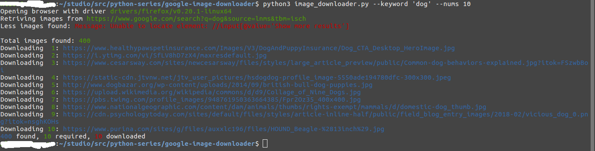

Download any number of images from Google image search.

> This source is based on [atif93](https://github.com/atif93/google_image_downloader)

- run as 

```
python image_downloader.py 
       --keyword <keyword> # keyword to search images
       --nums <number-of-images-to-retrieve> # number of images to download
       --savepath <path-to-save-images> # directory where downloaded images will save
       --driver <directory-where-brower-driver-exists> # brower driver, please specify exact same version of brouwer version you are using
       --google-domain <google-domain> # google domain, e.g., https://www.google.com, https://www.google.co.jp
       --image-type <image-types> # image types to download. e.g., 'jpg,png,gif'
```

- screen shot
  


All the images are downloaded from Google image search. These should be used for educational purposes only. Copyright is owned by the respective websites.
